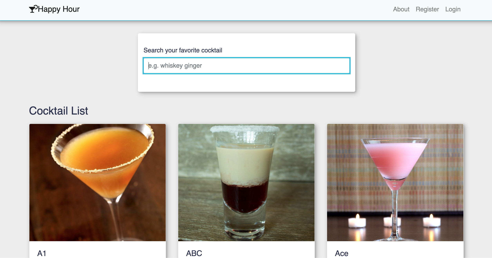
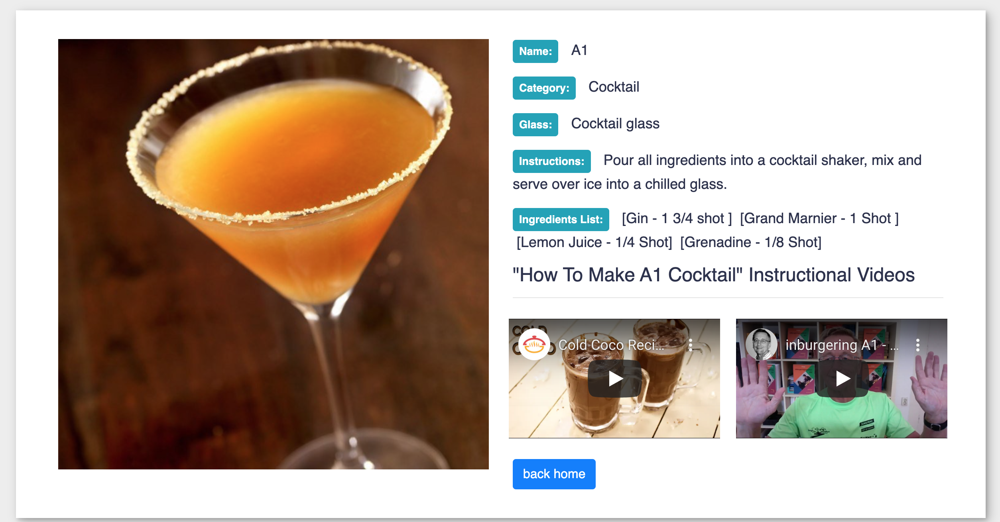
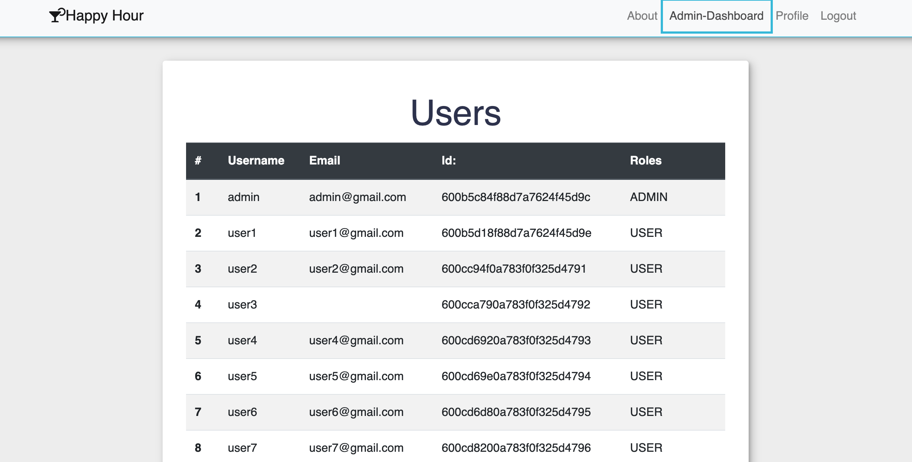

# Happy Hour

## Technologies Used
React.js / Youtube API / CocktailsDB API /Express / Node / Mongodb / Javascript / Bootstrap 

## Project Description 

Happy Hour allows users to search their favorite drink using the CocktailDB API. Searches are performed every keydown to update after every letter. Cocktail Detail page provides details and also fetches the youtube API for instructional videos to go along with instructions. Users can also register and login, Admins can login and have an admin board with a list of users. Styles applied with SASS and BEM.

## Quickstart

`cd to root folder`

`npm start`

** Check out the live app on [Heroku](https://react-socialmeds-client.herokuapp.com/)

## License

MIT
